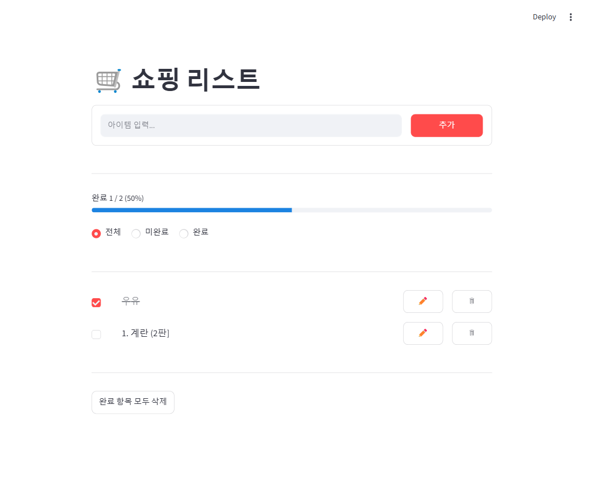

# 🛒 쇼핑 리스트

Streamlit으로 만든 장보기 목록 앱. 아이템을 추가하고, 이름을 고치고, 구매한 것을 체크하고, 필요 없어진 항목을 지웁니다.



## 기능

- **추가** — Enter 또는 추가 버튼. 빈 입력·50자 초과·중복은 거부하고 이유를 알려줍니다.
- **수정** — ✏️ 로 해당 행만 편집 모드로 바뀝니다. 완료 상태와 순서는 유지됩니다.
- **삭제** — 🗑 로 즉시 삭제. 완료 항목을 한 번에 비우는 버튼도 있습니다.
- **체크** — 구매한 항목에 취소선이 그어지고 진행률이 갱신됩니다.
- **필터** — 전체 / 미완료 / 완료
- **저장** — 조작할 때마다 `items.json`에 저장돼 새로고침해도 목록이 남습니다.

## 설치와 실행

Python 3.9 이상이 필요합니다.

```bash
pip install -r requirements.txt
streamlit run app.py
```

브라우저에서 http://localhost:8501 이 열립니다.

`python` 명령을 찾지 못하면 전체 경로로 실행하세요:

```bash
python -m streamlit run app.py
```

## 데이터 저장

목록은 `app.py`와 같은 폴더의 `items.json`에 저장됩니다.

```json
{
  "next_id": 3,
  "items": [
    { "id": 1, "name": "우유", "done": true },
    { "id": 2, "name": "계란 2판", "done": false }
  ]
}
```

- 파일이 없으면 빈 목록으로 시작합니다.
- 파일이 깨져 있어도 앱은 죽지 않고 경고와 함께 빈 목록으로 시작합니다.
- 임시 파일에 쓴 뒤 교체하므로, 저장 도중 중단돼도 기존 파일이 깨지지 않습니다.
- 개인 목록이라 `.gitignore`로 제외돼 있습니다. 저장소에는 올라가지 않습니다.

손으로 편집해도 되지만 **UTF-8로 저장**하세요. 한글 이름이 깨집니다. (BOM은 있어도 됩니다.)

## 구조

| 파일 | 내용 |
|---|---|
| `app.py` | 앱 전체. 상태 → 동작 → 화면 순으로 읽힙니다. |
| `requirements.txt` | `streamlit>=1.36` |
| `PRD.md` | 요구사항 정의서 |
| `PROMPTS.md` | 이 앱을 만든 단계별 개발 프롬프트 |

## 알아 둘 점

- **단일 사용자용입니다.** 로그인이 없고, 같은 기기에서 여러 브라우저 탭을 열면 같은 `items.json`을 공유합니다.
- Streamlit 1.36 이상이 필요합니다 (`st.columns`의 `vertical_alignment`).
- 아이템 이름은 마크다운으로 해석되지 않습니다. `1. 계란`이나 `**특가**` 를 입력해도 글자 그대로 보입니다.

## 만들면서 부딪힌 것

기록해 둘 만한 함정 두 가지:

- `st.session_state.items` 는 우리가 저장한 리스트가 아니라 매핑의 `.items()` **메서드**를 돌려줍니다. `items` 가 딕셔너리 메서드 이름과 겹치기 때문입니다. `st.session_state["items"]` 로 접근해야 합니다.
- 위젯 `key` 에 리스트 인덱스를 쓰면 항목을 지웠을 때 체크 상태가 다른 항목으로 밀립니다. 아이템 id 를 key 에 넣어야 합니다.
